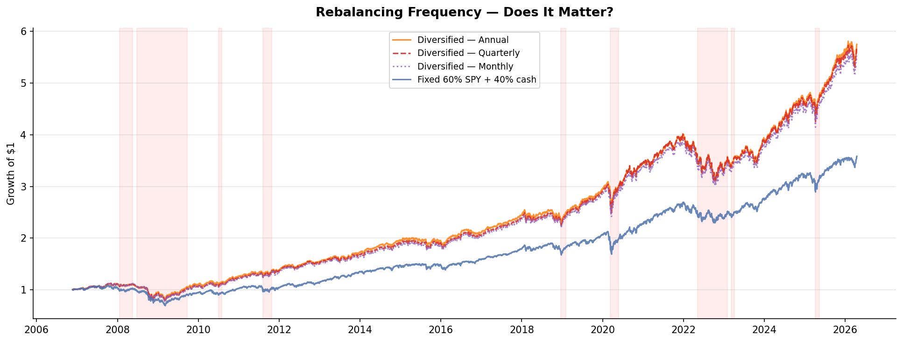
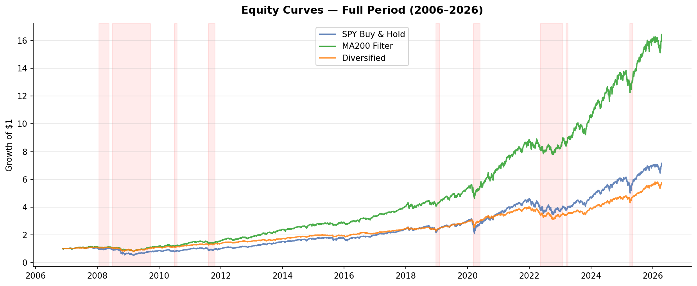
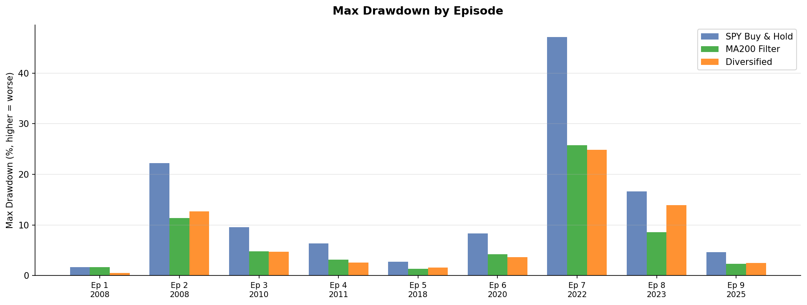
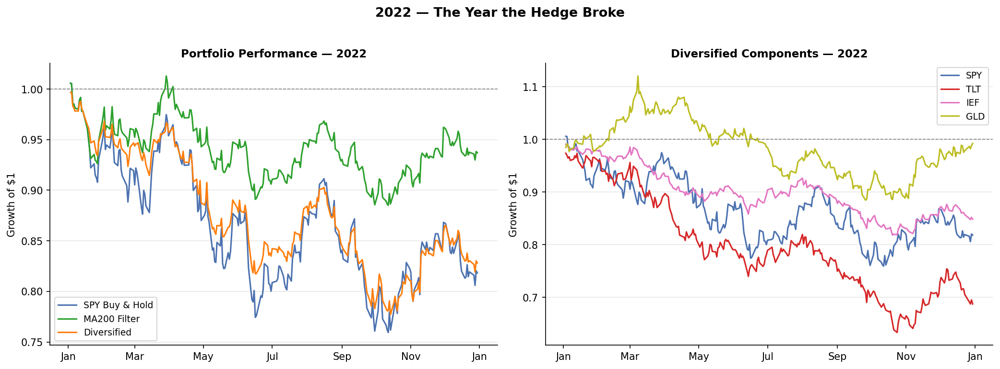
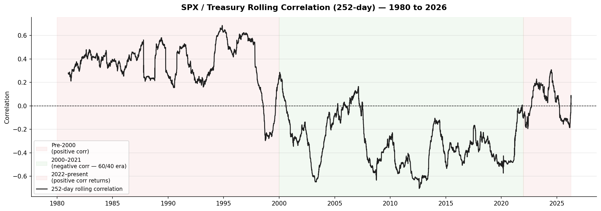
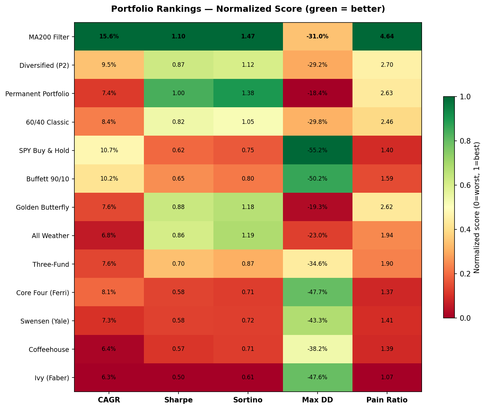

# The Diversification Tax

**Project 2 of The Diversification Series**

---

## The Question

The standard framework assumes correlation. Hold assets that move in opposite directions — equities and bonds, stocks and gold — and when one falls, the other cushions the blow. The question this project asks is not whether diversification works — it is whether the mechanism is what the framework says it is.

Specifically: is the protection in diversified portfolios delivered by the correlation between assets, or simply by having less equity exposure? The answer changes what you should ask your portfolio manager.

---

## The Core Finding — Mechanism First

The protection mechanism in diversified portfolios is exposure dilution, not asset correlation.

This was tested by comparing portfolios with identical or similar equity exposure but different structures:

| Portfolio | CAGR | Max DD (stress) | Normal Regime Return |
|---|---|---|---|
| Diversified — Annual rebalance | 9.46% | -25.07% | 314% |
| Diversified — Quarterly rebalance | 9.38% | -27.24% | 307% |
| Diversified — Monthly rebalance | 9.24% | -28.17% | 305% |
| Fixed 60% SPY + 40% cash | 6.81% | -29.77% | 188% |

Rebalancing frequency does not materially change the result. Annual, quarterly, and monthly rebalancing produce nearly identical outcomes — 314%, 307%, and 305% cumulative return in normal regimes, and max drawdowns of -25%, -27%, and -28% in stress. The rebalancing premium is not the mechanism.

The Fixed 60% SPY + 40% cash portfolio — no hedging assets, no timing, no correlation management — delivers stress protection comparable to all three Diversified variants. The hedging assets (TLT, IEF, GLD) do add real return over cash in normal regimes — approximately 2.7pp of CAGR annually, compounding to the difference between 188% and 314% cumulative return. But the protection mechanism in stress is not driven by the correlation properties of those assets. It is driven by the reduction in equity exposure itself. **The hedging assets earn their keep in normal regimes. They do not earn their keep as a protection mechanism in stress.**



This has a direct consequence for the cost of diversification: TLT, IEF, and GLD add return over cash in normal regimes — but the protection they are sold as providing in stress is not delivered by their correlation properties. It is delivered by the simple fact of holding less SPY. The standard framework charges for correlation-based protection. The data shows the protection comes from something simpler and cheaper.

The Diversified portfolio underperforms SPY Buy & Hold by approximately 110 percentage points in cumulative return over normal regime days (423% vs 314%). This is not bad luck or a bad period. It is the structural cost of complexity that does not add the mechanism it claims to add.

---

## Portfolio Definitions

**Main portfolios:**

| Portfolio | Composition | Rebalancing |
|---|---|---|
| SPY Buy & Hold | 100% SPY | None |
| MA200 Filter | 100% SPY above 200-day MA / 50% SPY + 50% cash below | Signal-based (daily) |
| Diversified | 60% SPY + 13.33% TLT + 13.33% IEF + 13.33% GLD | Annual (first trading day of year) |

**Classic portfolios tested in robustness check:**

| Portfolio | Composition |
|---|---|
| 60/40 Classic | 60% SPY + 40% IEF |
| Permanent Portfolio | 25% SPY + 25% TLT + 25% SHY + 25% GLD |
| All Weather | 30% SPY + 40% TLT + 15% IEF + 7.5% GLD + 7.5% DBC |
| Golden Butterfly | 20% SPY + 20% IWN + 20% TLT + 20% SHY + 20% GLD |
| Swensen (Yale) | 30% SPY + 15% EFA + 5% EEM + 20% VNQ + 15% IEF + 15% TIP |
| Ivy (Faber) | 20% SPY + 20% EFA + 20% AGG + 20% VNQ + 20% DBC |
| Three-Fund | 48% SPY + 12% EFA + 40% AGG |
| Core Four (Ferri) | 48% SPY + 24% EFA + 8% VNQ + 20% AGG |
| Coffeehouse | 10% SPY + 10% IVE + 10% IWM + 10% IWN + 10% EFA + 10% VNQ + 40% AGG |
| Buffett 90/10 | 90% SPY + 10% SHY |

All classic portfolios rebalance annually on the first trading day of each year. All ETFs verified available from February 2006 onward.

---

## Performance Comparison

Over the full investable sample (November 2006 – April 2026):

| Portfolio | CAGR | Sharpe | Max Drawdown | Pain Ratio | Recovery Days |
|---|---|---|---|---|---|
| SPY Buy & Hold | 10.70% | 0.62 | -55.19% | 1.40 | 1,256 |
| MA200 Filter | 15.56% | 1.10 | -30.97% | 4.64 | 288 |
| Diversified (60/40+Gold) | 9.46% | 0.87 | -29.20% | 2.70 | 311 |

The MA200 Filter — 100% SPY when above its 200-day moving average, 50% SPY + 50% cash when below — dominates all tested portfolios in the risk/return space within this sample. This result is consistent with the decomposition finding: a rule that reduces SPY exposure when price signals deterioration, and holds full exposure otherwise, captures the protection mechanism without the permanent carry cost. See the section on the MA200 as illustration before interpreting the absolute CAGR figures.



**In normal regimes (83.9% of all trading days):**

| Portfolio | Annualized Return | Cumulative Return |
|---|---|---|
| SPY Buy & Hold | 10.75% | 4.2x |
| MA200 Filter | 15.55% | 9.4x |
| Diversified | 9.17% | 3.1x |

Note: the MA200 Filter also reduced exposure on 574 days classified as normal regime — days where the price signal had fired but no formal stress episode was detected. Part of the MA200 advantage in normal regimes reflects this mechanism, not pure carry cost of the Diversified portfolio. The carry cost interpretation applies cleanly to the SPY Buy & Hold vs Diversified comparison.

**In stress episodes:**

| Portfolio | Max Drawdown | Ann. Return |
|---|---|---|
| SPY Buy & Hold | -47.61% | 10.46% |
| MA200 Filter | -26.00% | 15.56% |
| Diversified | -25.07% | 10.93% |

The Diversified portfolio and the MA200 Filter deliver nearly identical downside protection in stress. Given the decomposition result, this similarity is expected — both reduce SPY exposure, through different mechanisms.



---

## The 2022 Case — A Predictable Failure of Premise

2022 was not a surprise. The rolling SPY/TLT correlation had been returning toward positive since 2021 — visible in the data before 2022 arrived. A manager monitoring rolling correlation would have observed the regime changing. The standard framework continued as if the underlying premise — negative equity/bond correlation — remained stable.

When 2022 arrived, the premise had already broken:

- SPY: -19%
- TLT: -30%
- IEF: -15%
- GLD: flat

The Diversified portfolio drew down -13.9% while the MA200 Filter drew down -8.6% — not because the MA200 is a superior instrument, but because it had reduced SPY exposure in May 2022 based on price alone, without depending on any correlation assumption that could break.



2022 is not evidence that correlation-based protection never works. It worked in 2008 and 2020. It is evidence that the protection is contingent on a macroeconomic regime that is not permanent — and that the regime was visibly deteriorating before the loss arrived.

---

## The Structural Context — Why the Premise is Fragile

The negative SPX/Treasury correlation that underpins the 60/40 portfolio is not a structural constant. Using data since 1980:

- **Pre-2000:** correlation persistently positive (0.2–0.6)
- **2000–2021:** correlation negative — the 20-year regime that the entire diversification industry was built on
- **2022–present:** correlation returning toward positive

The 20-year period of negative correlation was the exception, not the rule. 2022 was a return to the historical baseline.



This fragility has a structural explanation that goes beyond sample size. Using correlation as a protection tool inherits two limitations simultaneously. First, Pearson correlation is linear — it measures average co-movement but does not capture tail dependence or regime-dependent relationships. Second, it is backward-looking by construction — using historical correlation to build forward-looking protection assumes regime stability. The 1980–2026 data shows three distinct regimes. Assuming stability is not a small error — it is the wrong model for the problem. This connects directly to the limitation declared in Project 1, where these properties of linear correlation were documented formally.

---

## Robustness — 10 Classic Portfolios

The carry cost finding holds across all tested diversification frameworks:

| Portfolio | CAGR | Sharpe | Sortino | Max DD | Pain Ratio |
|---|---|---|---|---|---|
| **MA200 Filter** | **15.56%** | **1.10** | **1.47** | **-30.97%** | **4.64** |
| Diversified (P2) | 9.46% | 0.87 | 1.12 | -29.20% | 2.70 |
| Permanent Portfolio | 7.42% | 1.00 | 1.38 | -18.40% | 2.63 |
| Golden Butterfly | 7.63% | 0.88 | 1.18 | -19.30% | 2.62 |
| All Weather | 6.83% | 0.86 | 1.19 | -23.03% | 1.94 |
| 60/40 Classic | 8.41% | 0.82 | 1.05 | -29.76% | 2.46 |
| Three-Fund | 7.58% | 0.70 | 0.87 | -34.55% | 1.90 |
| Buffett 90/10 | 10.16% | 0.65 | 0.80 | -50.16% | 1.59 |
| Swensen (Yale) | 7.26% | 0.58 | 0.72 | -43.35% | 1.41 |
| Core Four (Ferri) | 8.09% | 0.58 | 0.71 | -47.73% | 1.37 |
| Coffeehouse | 6.44% | 0.57 | 0.71 | -38.18% | 1.39 |
| Ivy (Faber) | 6.30% | 0.50 | 0.61 | -47.60% | 1.07 |
| SPY Buy & Hold | 10.70% | 0.62 | 0.75 | -55.19% | 1.40 |

Every classic diversified portfolio faces the same trade-off: lower drawdown requires substantially lower CAGR. No portfolio resolves this trade-off within this sample. The pattern is consistent with the decomposition finding — all diversified portfolios achieve protection through exposure dilution, and all pay for it in normal regimes.



---

## On the MA200 Filter as Illustration, Not Prescription

The MA200 Filter is used in this project as the simplest possible instance of direct exposure management — not as a trading strategy or investment recommendation.

The structural argument is not "the MA200 dominates diversified portfolios." The structural argument is: **reducing exposure to the primary risk asset directly tends to dominate diversification by correlation as a protection mechanism — and the form of that reduction matters less than the fact of it.**

The decomposition result is the cleaner evidence for this claim than the MA200 performance figures. A fixed 60/40 cash portfolio — no timing, no signal — already approximates the protection of the fully diversified portfolio. The MA200 adds conditional timing on top of that baseline, which improves the normal-regime performance at the cost of whipsaws. Other implementations would test the same structural claim.

The performance figures for the MA200 Filter reflect both the mechanism and the specific sample. The 2006–2026 period begins shortly after the GFC trough and includes the longest bull market in modern SPY history. A trend-following rule applied to any risk instrument over this specific period would produce above-average absolute returns. The CAGR of 15.56% is not generalizable. The comparative argument is the finding. The absolute performance figure is context.

---

## Episode Detection

Stress episodes are inherited directly from Project 1 — identical algorithm, identical parameters. This is an intentional design choice for consistency across the series.

**Entry condition:**
- SPY cumulative drawdown from rolling 252-day peak exceeds 15%
- AND SPY price is below its 200-day moving average (shifted 1 day)

**Exit condition:**
- SPY price returns above MA200
- AND drawdown has recovered at least 7.5% from trough (or crossed above -20% if entry drawdown exceeded 20%)

The algorithm detected **9 episodes** over the extended sample (November 2006 – April 2026). Project 1 covered 2006–2024 and detected 7 episodes. Two additional episodes were detected with the extended data: Episode 8 (Banking Stress, March 2023) and Episode 9 (2025 selloff). These are not redefinitions — they are the same detector running on more data.

---

## MA200 Filter — Execution Assumptions

- Signal evaluated at daily close
- Execution at next day's close (1-day shift — no look-ahead bias)
- Above MA200: 100% SPY
- Below MA200: 50% SPY + 50% cash
- Cash return: 0% (conservative assumption — any positive cash return would further favor the MA200 Filter)
- Prices include reinvested dividends (Yahoo Finance `auto_adjust=True`)
- Warmup period: first 200 trading days excluded from all analysis
- 52 exit signals over the full sample (~2.6 per year)

---

## Methodology

**No look-ahead bias.** MA200 computed on closing prices, shifted 1 day. All signals use only data available at time t.

**Rebalancing.** All portfolios rebalance annually on the first trading day of each year. Weights normalized to sum exactly to 1.0.

**Sharpe ratio.** Textbook definition: `(mean daily return / std daily return) × √252`. Risk-free rate = 0.

**Sortino ratio.** `(mean daily return × 252) / (downside std × √252)`. Downside std computed on negative returns only.

**Pain ratio.** Annualized return divided by mean absolute drawdown over the full period.

**Regime classification.** Normal regime: all days outside algorithmically detected stress episodes (83.9% of sample). Stress regime: days within detected episodes (16.1% of sample).

**Two-sample architecture.** Main investable sample uses ETF returns (2006–2026). Historical context sample uses proxy series (1980–2026) for structural correlation analysis only — not for performance comparison.

---

## Declared Limitations

- Results are in-sample. No walk-forward or out-of-sample validation was performed. The 2006–2026 sample begins shortly after the GFC trough and includes the longest bull market in modern SPY history. A trend-following rule applied to any risk instrument over this specific period would produce above-average absolute returns. The CAGR figures for the MA200 Filter (15.56%) are not generalizable — they reflect both the mechanism and the sample. The comparative argument (exposure reduction vs correlation-based diversification) is robust to this caveat; the absolute performance figures are not.
- Transaction costs, slippage, and tax drag are not modeled. With ~52 signals over 20 years, impact is likely small but not zero.
- The 200-day window was not tested across alternative parameterizations (100, 150, 250, 300 days or EMA variants). Parameter sensitivity is a natural extension.
- Cash earns zero return when the MA200 Filter is out of the market. This understates, not overstates, the MA200 Filter advantage.
- All ETFs used in the classic portfolio robustness check were verified to have data available from February 2006 onward — prior to the November 2006 warmup cutoff. No ETF in the tested universe required forward-filling or partial-period treatment.
- Historical Treasury returns (1980–2026) are estimated via duration approximation (r ≈ −8.5 × Δyield / 100), not observed directly. Used for structural correlation analysis only.
- Stress episode detector sensitivity was not tested across alternative definitions (VIX-based, recession proxies, different drawdown thresholds).
- The rebalancing frequency test (annual, quarterly, monthly) shows negligible differences within this sample. This does not mean rebalancing never matters — it means the mechanism of protection is not rebalancing frequency but equity exposure level. Different assets, different weight configurations, or different market regimes may produce different results.
- The project does not test whether different implementations of direct exposure management (other MA windows, volatility-scaling, momentum signals) would produce similar results. The MA200 is one instance of the mechanism, not a proof of the mechanism's generality.
- All tested portfolios use static or annually rebalanced weights. Dynamic strategies — risk parity, target volatility, correlation-aware allocation — were not tested. A sophisticated practitioner may argue that dynamic correlation management addresses the regime-dependency problem identified here. Two responses: first, these strategies are not accessible to most individual investors without institutional access, management fees, and operational complexity that the typical 60/40 investor does not have. Second, the decomposition finding suggests that managing correlation more intelligently still builds on the wrong premise — if the protection mechanism is exposure dilution rather than correlation, then sophistication in correlation management does not address the mechanism. This remains an open question that the current data does not close.

---

## Data Sources

| Series | Source | Ticker/ID |
|---|---|---|
| US Equities ETF | Yahoo Finance | SPY |
| International Developed | Yahoo Finance | EFA |
| Emerging Markets | Yahoo Finance | EEM |
| Long Bonds | Yahoo Finance | TLT |
| Intermediate Bonds | Yahoo Finance | IEF |
| Gold | Yahoo Finance | GLD |
| Commodities | Yahoo Finance | DBC |
| Aggregate Bonds | Yahoo Finance | AGG |
| Short Treasuries | Yahoo Finance | SHY |
| REITs | Yahoo Finance | VNQ |
| Small Cap Value | Yahoo Finance | IWN |
| Small Cap Blend | Yahoo Finance | IWM |
| Large Value | Yahoo Finance | IVE |
| TIPS | Yahoo Finance | TIP |
| US Equities (SPX) | Yahoo Finance | ^GSPC |
| US Dollar Index | Yahoo Finance | DX-Y.NYB |
| 10Y Treasury Yield | FRED | DGS10 |

---

## Reproducing the Analysis

```bash
git clone https://github.com/Gabriel-t-09/diversification-p2
cd diversification-p2
pip install -r requirements.txt
jupyter notebook notebook/p2_analysis.ipynb
```

On first run, the notebook downloads data and saves to `data/ret_b.csv` and `data/ret_a.csv`. Subsequent runs load from cache.

---

## Part of The Diversification Series

This project stands alone. Data, methodology, and conclusions are self-contained.

Within the series:
- **Project 1:** The mechanism — risk asset correlation collapses rapidly under stress, regardless of how many risk assets are held.
- **Project 2 (this):** The practical consequence — diversification carries a permanent cost in normal regimes, its protection is regime-dependent, and both the cost and the protection are explained primarily by exposure dilution rather than by the hedging assets or the rebalancing process.
- **Project 3:** The structural explanation — why traditional assets share similar payoff direction under stress, and what genuine diversification requires.

---

## Requirements

```
yfinance
pandas_datareader
numpy
matplotlib
jupyter
```
